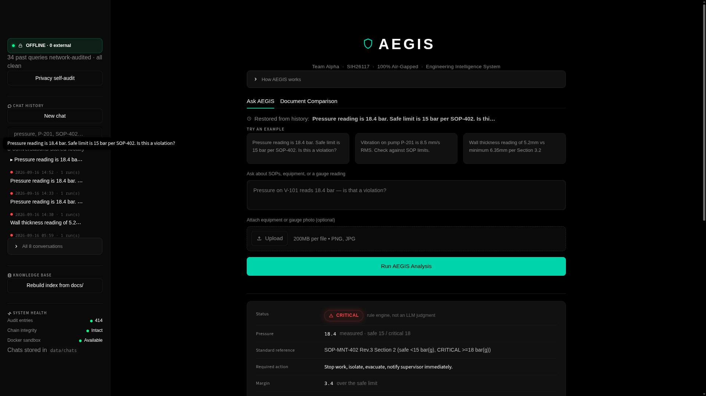

# AEGIS — Air-Gapped Engineering Intelligence System


SIH26117 · Team Alpha · Sovereign On-Premise Agentic AI Workbench using
Open-Weight Multimodal LLMs for Confidential Industrial Work.

AEGIS is a local AI assistant for refinery operators: it answers questions
grounded in your own SOPs, verifies the arithmetic in a sandbox, judges safety
thresholds with deterministic code rather than model opinion, and gates
safety-critical findings behind a named human sign-off. Every model, document,
index, chat and audit record stays on the machine it runs on — there are no API
keys, no cloud services, and nothing is ever sent anywhere.



---

## Hardware requirements

| | Minimum | Notes |
|---|---|---|
| RAM | 16GB | 8GB runs but swaps heavily under `qwen2.5:7b` |
| GPU | 4GB VRAM, or none | With less VRAM Ollama offloads layers to CPU — slower, still works |
| Disk | ~10GB free | Model weights (~8GB) + index + history |
| OS | Windows 10/11, Linux, or macOS | A dedicated installer for each |
| Python | 3.10 or newer | The installer creates its own isolated venv |

Reference machine for the measured timings below: ASUS TUF, i7-11800H,
RTX 3050 Ti (4GB), 16GB RAM, Arch Linux — roughly 10–60s per query.

---

> ## ⚠️ The one honest note about internet
>
> **First-time setup downloads ~8GB of AI models and needs internet ONCE.
> After setup, AEGIS runs 100% offline — no internet, ever.**
>
> You can disconnect the network permanently once `install` finishes and every
> feature keeps working. The launcher actively *refuses to start* if any
> configured endpoint points off-machine.

---

## Install

Two steps on every platform: **set up once** (needs internet — pulls the AI
models), then **run** (offline, forever). Setup is safe to re-run; it skips
anything already done, so an interrupted download just resumes.

### 🪟 Windows

Download the zip, unzip it, and **double-click `install.bat`, then `run.bat`.**
That's the whole thing — no terminal, no flags.

Prefer a terminal?

```powershell
Expand-Archive aegis.zip -DestinationPath aegis
cd aegis
.\install.bat
.\run.bat
```

> `install.bat` / `run.bat` are thin wrappers that call the PowerShell scripts
> with the right execution-policy flag for you, so a first-time user never has
> to know PowerShell exists. Advanced users can still call
> `powershell -ExecutionPolicy Bypass -File .\install.ps1` directly, and
> `run.bat -Port 8502` passes options straight through.

### 🐧 Linux / 🍎 macOS

```bash
unzip aegis.zip -d aegis && cd aegis
chmod +x install.sh run.sh
./install.sh
./run.sh
```

Prefer `make`? `make install`, `make run`, `make test`, `make index`,
`make clean`, `make reset-chats` (`make help` lists them).

---

**Don't have Ollama yet?** You don't need to install anything by hand — the
setup script installs it for you (via the official installer on Windows, the
official script on Linux, Homebrew or the official installer on macOS). If you'd
rather install it yourself first, get it from **https://ollama.com/download**;
the script detects it and skips ahead.

Once setup finishes, open **http://127.0.0.1:8501** — the launcher opens your
browser there automatically.

### What each step actually does

| Step | In plain English |
|---|---|
| `chmod +x install.sh run.sh` | Marks the two scripts as runnable. Zip files don't preserve the executable bit, so this is needed once. (Windows doesn't need it — use the `.bat` files.) |
| **Setup** (`install.bat` / `install.sh`) | Detects your OS, installs Ollama if you don't have it, starts it, downloads the three AI models, creates an isolated Python environment, installs the Python libraries, creates the local storage folders, copies `.env.example` to `.env`, reads your documents in `docs/` into a searchable index, and runs the test suite to prove it all works. **Safe to re-run** — anything already done is skipped, so a failed download resumes instead of restarting. |
| **Run** (`run.bat` / `run.sh`) | Starts the app: activates the Python environment, makes sure Ollama is running, **verifies nothing can reach the internet and refuses to start if it can**, builds the index if missing, opens your browser, and serves the console on `127.0.0.1:8501`. |

---

## How to use it

1. **Add your documents.** Drop SOPs, P&IDs or manuals (`.pdf`, `.txt`, `.md`)
   into `docs/`, then click **Rebuild index from docs/** in the sidebar (or run
   `make index`). A sample SOP is included so you can try it immediately.
2. **Ask a question.** Type it, or click one of the three example buttons —
   e.g. *"Pressure reading is 18.4 bar. Safe limit is 15 bar per SOP-402. Is
   this a violation?"* Optionally attach a gauge or equipment photo.
3. **Watch the pipeline run.** Each step — Plan, Vision, RAG, Calc, Safety
   Check, Reflect, Answer — flips from ⏳ to ✅ with its real elapsed time.
4. **Read the audited report.** You get the answer, the deterministic safety
   verdict, the retrieved SOP passages it used, the full reasoning trace, a
   network audit proving nothing left the machine, and the audit hash chain.
5. **Sign off if required.** Anything safety-critical is blocked behind a named
   supervisor sign-off, which is itself written to the audit log.
6. **Everything is saved automatically.** Each run is appended to the current
   chat in `data/chats/`. The sidebar shows every past conversation with a
   🟢 SAFE / 🟠 WARNING / 🔴 CRITICAL badge — search them, reopen one (the full
   report restores), export it to Markdown, or delete it.

There's also a **Document Comparison** tab: upload an old and a new revision of
an SOP and AEGIS diffs them, flags changed pressure/temperature/shutdown/SIL
values as HIGH or MEDIUM risk, and writes an MOC-style impact summary.

---

## Where your data lives

Everything is a plain file inside the project folder. Nothing leaves it.

| Path | Contents |
|---|---|
| `data/chats/` | Chat history — one human-readable JSON file per session |
| `data/chats/index.json` | Fast lookup index (derived — safe to delete, rebuilds itself) |
| `data/chats/media/` | Images you attached, copied in so history stays self-contained |
| `data/chats/exports/` | Markdown exports you generate from the UI |
| `data/embeddings/` | The FAISS vector index + BM25 index built from `docs/` |
| `logs/audit.jsonl` | SHA-256 hash-chained audit trail of every step of every run |
| `docs/` | Your source SOPs — the only folder you put things into |

`data/`, `logs/` and `temp/` are gitignored, so operator questions and plant
readings never reach version control.

---

## Data & privacy

- **No API keys. No cloud services. No accounts.** AEGIS talks to exactly one
  thing: the Ollama daemon on `127.0.0.1:11434`. There is no code path that
  requires a key from OpenAI, Anthropic, Google, HuggingFace or LangSmith.
- **Telemetry is force-disabled in code**, in `core/__init__.py`, at package
  import — before langchain/langsmith are loaded and can read those variables.
  An edited `.env` or an inherited shell export cannot switch it back on.
- **Your history is yours.** To read it: open any file in `data/chats/`. To
  export one: the **📄 Export this session** button writes Markdown to
  `data/chats/exports/`. To delete one: the 🗑 button in the sidebar. To wipe
  everything: `make reset-chats`, or just delete the folder.
- **Nothing is ever auto-deleted.** History is kept until you remove it.

---

## How to verify it's actually offline

AEGIS doesn't ask you to take its word for it.

**In the app:** the sidebar shows a live `🔒 OFFLINE MODE — 0 external
connections` badge (it turns red if anything reaches out), and the **🔎 Privacy
self-audit** button re-runs all four checks on demand and prints the raw socket
list so you can see for yourself that only `127.0.0.1:11434` was contacted.

**On startup:** `run.sh` / `run.ps1` runs four checks and **refuses to launch**
if any fail — endpoints resolve to loopback, telemetry switches are off, no
external sockets are open, and every network audit ever recorded was clean.

**Prove it yourself** — disconnect the network (or `nmcli networking off`), then:

```bash
ping -c1 8.8.8.8        # fails: no route to host
./run.sh                # starts anyway
```

Ask a question. It answers normally — FAISS, `nomic-embed-text`, `qwen2.5vl:3b`
and `qwen2.5:7b` all run locally against Ollama. For the receipts on the
command line:

```bash
./venv/bin/python -m core.offline_check
# offline_check ok — offline=True, external=[], network_audits_reviewed=N
```

The **only** exception, stated plainly: the first-time model pull during
install, which downloads the weights from `ollama.com`. Nothing else, ever.

---

## Troubleshooting

### All platforms

| Symptom | Fix |
|---|---|
| `Cannot reach Ollama at …` | Start it: `ollama serve`. The launcher tries this for you first. |
| Model download fails or stalls | Re-run the installer. Already-downloaded models are skipped, so it resumes rather than restarting the 8GB. |
| A model is missing | AEGIS prints the exact command, e.g. `ollama pull qwen2.5:7b`. |
| `offline verification failed — refusing to start` | `OLLAMA_HOST` in `.env` points off-machine. Set it to `http://localhost:11434`. |
| `The search index … is unreadable or corrupted` | Rebuild it — the sidebar button, or `make index`. No source documents are lost. |
| `No relevant documents found` | The index is empty. Put files in `docs/` and rebuild. |
| Answers are slow (10–60s) | Expected on a 4GB GPU — `qwen2.5:7b` partly runs on CPU. See ARCHITECTURE.md. |
| Docker warning at startup | Harmless. The calculator silently falls back to a restricted in-process evaluator. |

### 🐧 Linux

| Symptom | Fix |
|---|---|
| `Permission denied: ./install.sh` | `chmod +x install.sh run.sh` — the zip didn't preserve the executable bit. |
| `could not create the venv` | Ubuntu/Debian: `sudo apt install python3-venv`. Arch: `sudo pacman -S python`. |
| Ollama service won't start | `sudo systemctl start ollama`, or run `ollama serve` in its own terminal. |
| `port 8501 is already in use` | `AEGIS_PORT=8502 ./run.sh`, or stop the other process. |
| Activate venv manually | `source venv/bin/activate` |

### 🍎 macOS

| Symptom | Fix |
|---|---|
| Ollama not found and no Homebrew | Install from https://ollama.com/download, then re-run `./install.sh`. |
| `brew services start ollama` fails | Just run `ollama serve` in a separate terminal. |
| `"install.sh" cannot be opened because it is from an unidentified developer` | Run it from Terminal (`./install.sh`) rather than double-clicking. |
| Apple Silicon (M1–M4) | Fully supported — Ollama ships native arm64 builds. |
| Activate venv manually | `source venv/bin/activate` |

### 🪟 Windows

| Symptom | Fix |
|---|---|
| `…install.ps1 cannot be loaded because running scripts is disabled` | Use the `.bat` launchers (`install.bat` / `run.bat`) — they set the policy for that one run. Or call `powershell -ExecutionPolicy Bypass -File .\install.ps1` directly. |
| Double-clicking `install.ps1` opens Notepad | That's expected — Windows edits `.ps1` on double-click. Double-click **`install.bat`** instead. |
| `ollama: command not found` right after installing it | Close PowerShell, open a **new** window (so PATH refreshes), re-run `.\install.ps1`. |
| Python opens the Microsoft Store | The Store stub is on PATH. Install real Python: `winget install Python.Python.3.12`, tick *Add python.exe to PATH*, open a new window. |
| `port 8501 is already in use` | `.\run.ps1 -Port 8502`, or stop the other process. |
| Activate venv manually | `.\venv\Scripts\Activate.ps1` |
| Windows Defender/firewall prompt | Allow it on **Private** networks only. AEGIS binds loopback and does not need any network permission to function. |

---

## Architecture

```
Plan → Vision (if image attached) → RAG → Calc → Safety Check → Reflect ──┬─→ Answer
                    ^                                                     │
                    └───────────────────── retry (≤2x) ────────────────────┘
```

Every node logs to `logs/audit.jsonl` (SHA-256 hash-chained — `audit.verify()`
finds the first broken link if any past entry is edited). Every run also
performs a network audit over its own process tree, and auto-saves to
`data/chats/`. See **ARCHITECTURE.md** for the full technical detail.

**Safety check is deterministic, not an LLM judgment.** The planner LLM only
extracts which check applies and the numbers involved (grounded in the query
and retrieved SOP text — the prompt explicitly forbids inventing a threshold);
`core/safety_rules.py`'s plain comparisons decide the verdict. A hallucinated
extraction can point at the wrong check, but it can never talk its way past a
CRITICAL/EXCEEDS/BELOW_MINIMUM verdict.

## Project layout

```
install.bat / run.bat     — Windows double-click launchers (wrap the .ps1 scripts)
install.sh / install.ps1  — one-time setup (the only step needing internet)
run.sh     / run.ps1      — start the app (fully offline; verifies before launching)
Makefile                  — install / run / test / index / clean / reset-chats
.streamlit/config.toml    — telemetry off, loopback-only binding, CORS+XSRF on
core/agent.py             — LangGraph state machine + friendly_error() translator
core/rag.py               — hybrid FAISS + BM25 retrieval over docs/
core/tools.py             — vision (Qwen2.5-VL), sandboxed calc, RAG search
core/audit.py             — SHA-256 hash-chained JSONL audit log
core/safety_rules.py      — deterministic pressure/temperature/vibration/thickness checks
core/doc_diff.py          — SOP/P&ID revision diffing + risk-rated safety flagging
core/history.py           — local chat persistence (data/chats/), atomic writes
core/offline_check.py     — four-way offline verification + assert_offline()
core/network_monitor.py   — per-query air-gap audit
ui/app.py                 — Streamlit console: history, live pipeline, sign-off, privacy audit
config/                   — safety_limits.example.json: template for your verified thresholds
docs/                     — SOPs to index (PDF/TXT/MD)
test_aegis.py             — end-to-end smoke test
```

## Environment variables

`install` copies `.env.example` to `.env` for you. All values have working
defaults, and **none of them is a key or a credential.**

| Var | Default | Purpose |
|---|---|---|
| `OLLAMA_HOST` | `http://localhost:11434` | local Ollama server — must stay loopback or the launcher refuses to start |
| `LLM_MODEL` | `qwen2.5:7b` | reasoning model |
| `VISION_MODEL` | `qwen2.5vl:3b` | vision model — reads gauges + P&ID/drawing text (fall back to `moondream` on very low VRAM) |
| `EMBED_MODEL` | `nomic-embed-text` | embedding model for RAG |
| `DOCS_DIR` | `docs` | SOPs to index |
| `INDEX_DIR` | `data/embeddings` | FAISS + BM25 index output |
| `CHATS_DIR` | `data/chats` | local chat history |
| `RAG_TOP_K` | `4` | retrieved chunks per query |
| `AUDIT_LOG` | `logs/audit.jsonl` | hash-chained audit log path |
| `SANDBOX_IMAGE` | `python:3.12-slim` | Docker image for the sandboxed calc tool |
| `SANDBOX_TIMEOUT` | `10` | seconds before the sandbox run is killed |
| `SAFETY_LIMITS_FILE` | `config/safety_limits.json` | your own verified thresholds — copy from the example; never pre-populated by AEGIS |
| `AEGIS_PORT` | `8501` | port for the launcher |

Telemetry switches (`LANGCHAIN_TRACING_V2`, `LANGCHAIN_ENDPOINT`,
`LANGSMITH_TRACING`, `ANONYMIZED_TELEMETRY`, `HF_HUB_OFFLINE`,
`TRANSFORMERS_OFFLINE`, `SCARF_NO_ANALYTICS`, `DO_NOT_TRACK`,
`STREAMLIT_BROWSER_GATHER_USAGE_STATS`) are **force-set to disabled** by
`core/__init__.py` at import time and cannot be re-enabled via `.env`.

## FAQ

**Does it need internet?**
Once, during install, to download ~8GB of model weights. After that, never.
You can physically disconnect the machine and every feature keeps working.

**Where is my data?**
All of it is in the project folder: `data/chats/` (conversations),
`data/embeddings/` (search index), `logs/audit.jsonl` (audit trail). Plain
files you can read, copy, export or delete. Nothing is uploaded anywhere.

**Do I need an API key?**
No. AEGIS has no cloud dependency of any kind — that's the entire point. All
three models run locally through Ollama.

**Can I use bigger models?**
Yes. Pull one (`ollama pull qwen2.5:14b`) and set `LLM_MODEL=qwen2.5:14b` in
`.env`. Same for `VISION_MODEL` and `EMBED_MODEL` — change `EMBED_MODEL` and
you must rebuild the index (`make index`), since old vectors aren't comparable
to new ones. Bigger models need proportionally more VRAM/RAM.

**How do I add my own SOPs?**
Copy `.pdf`, `.txt` or `.md` files into `docs/`, then click **Rebuild index
from docs/** in the sidebar (or run `make index`). They're indexed locally with
`nomic-embed-text`; the documents never leave the machine.

**Can others on my network reach it?**
No. The server binds `127.0.0.1` only, never `0.0.0.0`, so it isn't reachable
from the plant LAN. CORS and XSRF protection are on, so a malicious page in
your own browser can't reach it over localhost either.

**Is the audit log tamper-proof?**
Tamper-*evident*. Editing any past entry breaks every hash after it and
`audit.verify()` reports the first broken link. It cannot prove entries were
never truncated and re-chained — that needs an external anchor.

## Honest architecture table — pitch deck vs. this prototype

| Deck component | This prototype | Why |
|---|---|---|
| vLLM · Qwen2.5-Coder-32B | Ollama · qwen2.5:7b | Fits a single consumer GPU; vLLM/32B is the scale-up path once on dedicated server hardware |
| Qwen2.5-VL-7B (defect boxes) | Ollama · qwen2.5vl:3b (text description) | The 3B Qwen2.5-VL reads gauge displays and P&ID/drawing text (tag numbers, pressure ratings, revisions) — verified reading "285 psig / Rev C" off a sample P&ID that moondream could not. It returns prose, not structured defect bounding boxes; the 7B/32B variants or a fine-tune are the scale-up path once on more VRAM |
| LanceDB + bge-m3 hybrid retrieval | FAISS + BM25 hybrid (`nomic-embed-text` + `rank-bm25`, reciprocal-rank fusion) | Same hybrid dense+keyword property the deck claims (catches exact SOP IDs like "SOP-MNT-402" that pure-vector search misses), without standing up a new vector DB |
| Next.js + React Flow live DAG | Streamlit | One file, no frontend build step, fast to demo |
| FastAPI + Redis | direct Python calls | No queue/service boundary needed at single-user prototype scale |
| Docker/gVisor sandbox, network=none | Docker, network=none (no gVisor runtime installed) | Real container isolation for the calc/code tool: `--network=none --read-only --cap-drop=ALL --security-opt=no-new-privileges` + memory/pids/cpu limits. Falls back to an in-process math-only `eval()` if the Docker daemon isn't reachable, so a live demo never hard-fails on infra. gVisor (`runsc`) would add syscall-level isolation on top — not installed here |
| "Hard iteration cap (max 4 cycles)" | Reflect can loop back to RAG at most `MAX_LOOPS=2` times (`core/agent.py`) | Implemented as a real conditional edge in the LangGraph state machine, not just a deck claim |
| "Human-in-the-loop sign-off" | Reflect + a deterministic keyword backstop (`core/agent.py:_mentions_safety_risk`) flag `requires_approval`; the UI blocks on a named supervisor sign-off, logged as its own audit event | The LLM's own approval judgment is non-deterministic on identical input — verified by running the same violation query 3x with 3 different reflect outputs, all flagged (2 by the LLM, 1 by the keyword backstop). Never gate safety sign-off on a single LLM call alone |

## Known gaps

- No LanceDB, FastAPI/Redis, Next.js/React Flow, or gVisor — see the table above for what stands in for each and why.
- Vision (`qwen2.5vl:3b`) returns a text description, not structured defect bounding boxes. It reliably reads gauge/digital displays and P&ID/drawing text, but analog-needle *angle* estimation is approximate (it reads the dial numbers correctly but can misjudge exactly where the needle points). On a 4GB GPU the VL model offloads partly to CPU, so image queries run slower (~20–50s of vision time) than text-only ones.
- Single-user, single-process — no RBAC/multi-tenant plant-DMZ deployment yet.
- `safety_rules.py`'s vibration/wall-thickness checkers are generic threshold evaluators, not preloaded with ISO 10816-3 (or any other) table values — limits must come from the query, retrieved SOP text, or your own `config/safety_limits.json`, so the system never asserts an unverified regulatory number as fact.
- `core/doc_diff.py` splits documents into sections on blank lines and pairs revisions by text similarity (stdlib `difflib`); its safety-critical flagging is a keyword heuristic that deliberately over-flags. Works well on prose-style SOPs, untested on structured P&ID exports.
- The audit log is tamper-*evident*, not tamper-proof (see FAQ).
- The Windows installers have now been run end-to-end on real Windows 11 / PowerShell 5.1 (`install.ps1` through all 10 steps, `run.ps1` through the app serving a full query and the privacy self-audit). That run caught and fixed three Windows-only bugs that line-review alone had missed: a non-ASCII character in a BOM-less `.ps1` got misdecoded by PowerShell 5.1's codepage-based file reading and broke string parsing (fixed by adding a UTF-8 BOM to both `.ps1` files); a multi-line Python snippet passed via `python -c` got truncated by PowerShell's native-argument quoting (fixed by writing it to a temp `.py` file and setting `PYTHONPATH` instead, since a script file's own directory — not the caller's cwd — lands on `sys.path[0]`); and the `Remove-Item` cmdlet itself failed to resolve a `%TEMP%` path built on an 8.3 short name on this machine (fixed with `[System.IO.File]::Delete`). macOS remains reviewed-but-unexecuted; a real portability bug was fixed there too (`readlink -f` doesn't exist on stock/BSD `readlink`, so `install.sh`/`run.sh` used a `dirname`+`pwd` idiom instead) but nobody has run it on an actual Mac.

## License

MIT — see [LICENSE](LICENSE).
